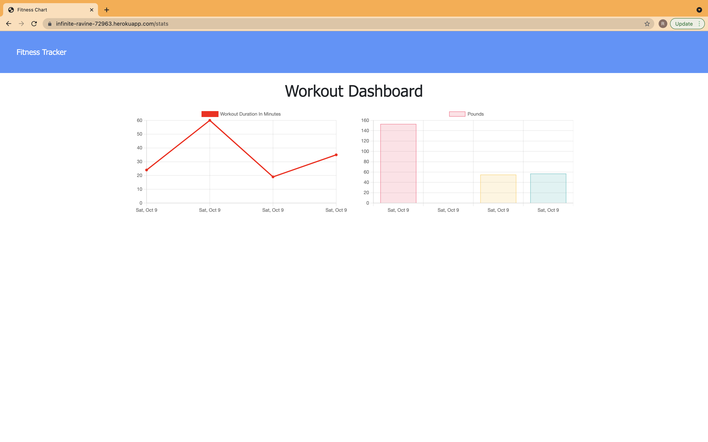
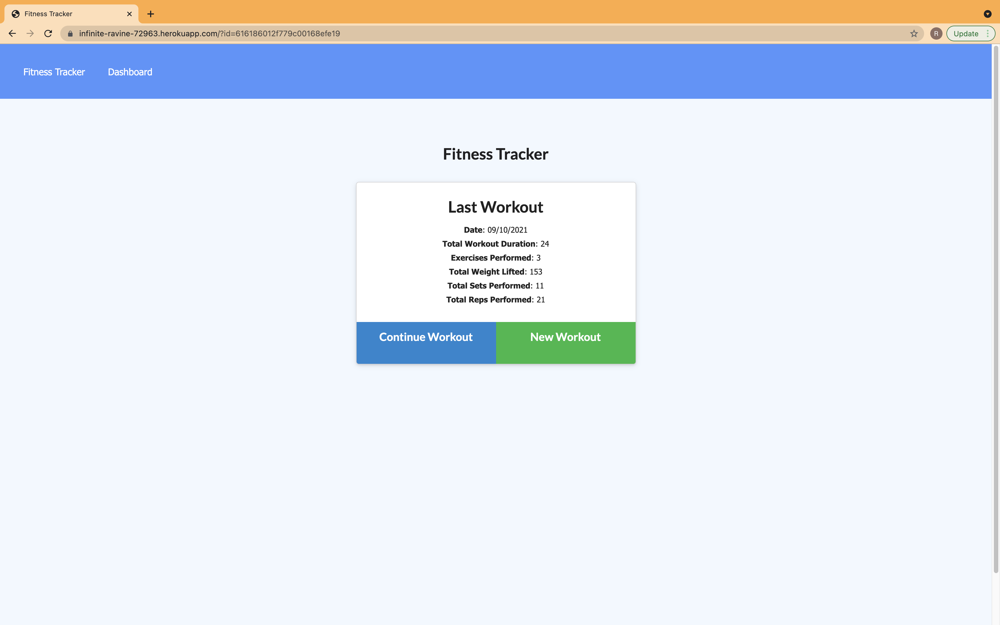

# Workout-Tracker
Use this app to view, create and track daily workouts. You can log multiple exercises in a workout on a given day. You would also be able to track the name, type, weight, sets, reps, and duration of exercise. If the exercise is a cardio exercise, you would be able to track the distance traveled.


## Table of contents

- [Description](#Description)
- [Heroku Deployed Link](#DeployedApp)
- [Installation](#Installations)
- [Usage](#Usage)
- [Testing](#Testing)
- [Contributing](#Contributing)
- [Questions](#Questions)
- [License](#License)

## Description

```md
When the user loads the page, they are given the option to create a new workout or continue with their last workout.

The user is able to:

  * Add exercises to the most recent workout plan.

  * Add new exercises to a new workout plan.

  * View the combined weight of multiple exercises from the past seven workouts on the `stats` page.

  * View the total duration of each workout from the past seven workouts on the `stats` page.
```

## DeployedApp

https://infinite-ravine-72963.herokuapp.com/

## Screenshots





## Usage

you will reach your fitness goals more quickly when you track your workout progress.

## Installations

```md
npm install
npm install express --save
npm install mongoose
```
## Heroku deployment
Create heroku app using these commands
```md
heroku --version
heroku login
heroku create
```
Push to heroku using
```md
git add -A
git commit -m 'deploying'
git push heroku main
```

## Run
Keep the following terminals running  to use this app on localost

```md
mongod
node server.js
```

## Testing

Test the app using heroku link and run the app.

## Contributing

Rajni Dua

## Questions

For any further questions, reachout to me at :

- Github: [rajnidua](https://github.com/rajnidua)
- Email: rajni.dua14@gmail.com

## Reference Documents
set up mongo atlas
https://coding-boot-camp.github.io/full-stack/mongodb/how-to-set-up-mongodb-atlas

Deploy with mongodb and atlas
https://coding-boot-camp.github.io/full-stack/mongodb/deploy-with-heroku-and-mongodb-atlas


## License


&copy; 2021 Rajni Dua

_Licensed under [MIT](./license)_
